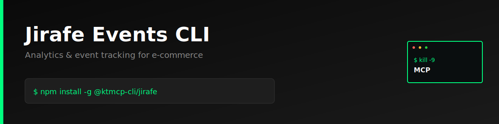

> "Six months ago, everyone was talking about MCPs. And I was like, screw MCPs. Every MCP would be better as a CLI."
>
> — [Peter Steinberger](https://twitter.com/steipete), Founder of OpenClaw
> [Watch on YouTube (~2:39:00)](https://www.youtube.com/@lexfridman) | [Lex Fridman Podcast #491](https://lexfridman.com/peter-steinberger/)

# Jirafe Events CLI

> **⚠️ Unofficial CLI** - Not officially sponsored or affiliated with Jirafe.

A production-ready command-line interface for [Jirafe Events API](https://jirafe.com) — analytics and event tracking for e-commerce. Track page views, products, carts, orders, and custom events directly from your terminal.

## Features

- **Page Views** — Track page visits and navigation
- **Product Events** — Track product views, cart additions, purchases
- **Cart Events** — Monitor cart operations
- **Order Tracking** — Record completed orders
- **User Events** — Track user registration, login, updates
- **Custom Events** — Send any custom event data
- **JSON output** — All commands support `--json` for scripting
- **Colorized output** — Clean terminal output with chalk

## Installation

```bash
npm install -g @ktmcp-cli/jirafe
```

## Quick Start

```bash
# Configure with your site ID and token
jirafe config set --site-id YOUR_SITE_ID --token YOUR_TOKEN

# Track a page view
jirafe track pageview "/products/shoes" --title "Shoes"

# Track product view
jirafe track product view prod-123 --name "Running Shoes" --price 89.99

# Track an order
jirafe track order order-456 --total 189.99
```

## Commands

### Config

```bash
jirafe config set --site-id <id> --token <token>
jirafe config show
```

### Track Events

#### Page Views

```bash
jirafe track pageview "/home"
jirafe track pageview "/products" --title "Products" --referrer "/home"
```

#### Products

```bash
jirafe track product view prod-123
jirafe track product add_to_cart prod-123 --name "Shoes" --price 89.99
jirafe track product purchase prod-123
```

#### Cart

```bash
jirafe track cart add --total 199.99
jirafe track cart remove
jirafe track cart checkout --total 199.99
```

#### Orders

```bash
jirafe track order order-123 --total 299.99
jirafe track order order-456 --total 499.99 --items '[{"id":"prod-1","qty":2}]'
```

#### Users

```bash
jirafe track user signup user-789 --email "user@example.com" --name "John"
jirafe track user login user-789
jirafe track user update user-789 --name "John Doe"
```

#### Custom Events

```bash
jirafe track custom "newsletter_signup" '{"email":"user@example.com"}'
jirafe track custom "video_play" '{"video_id":"vid-123","duration":120}'
```

## JSON Output

All commands support `--json` for structured output:

```bash
jirafe track pageview "/home" --json
jirafe track order order-123 --total 299.99 --json
```

## Why CLI > MCP?

No server to run. No protocol overhead. Just install and go.

- **Simpler** — Just a binary you call directly
- **Composable** — Pipe to `jq`, `grep`, `awk`
- **Scriptable** — Works in cron jobs, CI/CD, shell scripts

## License

MIT — Part of the [Kill The MCP](https://killthemcp.com) project.
